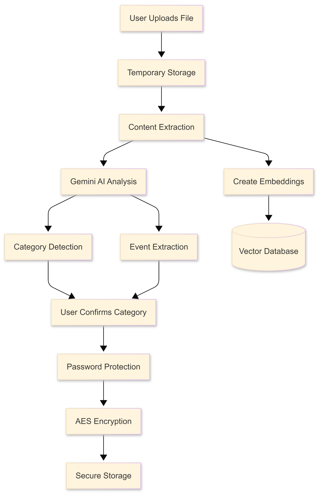
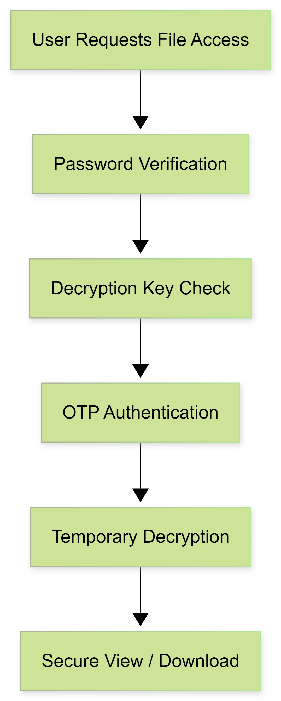
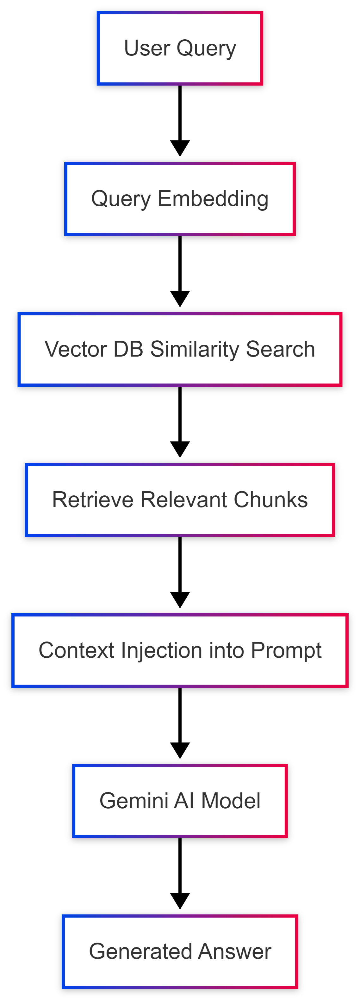

# 🔐 Data Vault – Secure File Storage & Intelligent Document Management

Data Vault is an AI-powered secure cloud document management platform that combines strong encryption, intelligent document analysis, controlled sharing workflows, and trust-based monitoring.

Unlike traditional file storage systems, Data Vault transforms documents into secure, intelligent, and trackable digital assets.

---

## 🚀 Key Features

- 🔐 Secure file upload with password protection and AES encryption
- 🤖 AI-powered document analysis using Google Gemini API
- 📄 Automatic category detection & event extraction
- 🔗 Secure sharing with permissions and OTP authentication
- 💬 Retrieval-Augmented Generation (RAG) chatbot
- 📊 Trust score monitoring and analytics dashboard

---

## 🏗️ High-Level System Architecture

The system follows a layered architecture:

- Streamlit UI
- Python Backend Controller
- Security Module
- AI Intelligence Module
- MongoDB Database
- Vector Database (Chroma)

---

## 📄 File Upload & Processing Flow

Workflow:

1. User uploads document
2. Content extraction
3. Gemini AI analysis
4. Category detection & event extraction
5. User confirmation
6. Password protection
7. AES encryption
8. Secure storage

---

## 🔐 Security Authentication Flow

Multi-layer security approach:

- Password verification
- Decryption key validation
- OTP authentication
- Temporary decryption
- Secure viewing/download

---

## 💬 RAG Chatbot Architecture

Process:

1. User query
2. Query embedding
3. Vector DB similarity search
4. Retrieve relevant chunks
5. Context injection into prompt
6. Gemini AI response

---

## 🔗 File Sharing & Trust Score Workflow

Features:

- Permission-based sharing
- OTP-secured access
- View/download/reshare tracking
- Trust score updates
- Analytics dashboard

---

## ⚙️ Technology Stack

### Frontend
- Streamlit

### Backend
- Python

### Database
- MongoDB
- Chroma Vector Database

### APIs
- Google Gemini AI API
- Tavily API
- Ngrok API

---

## 🔐 Security Design

- AES encryption
- Password-protected documents
- OTP-based authentication
- Zero plain-text storage

---

## 🤖 AI Capabilities

- Automatic document categorization
- Event extraction
- Semantic search via embeddings
- Context-aware chatbot interaction

---

## 👩‍💻 Author

Akshitha Chiluka
